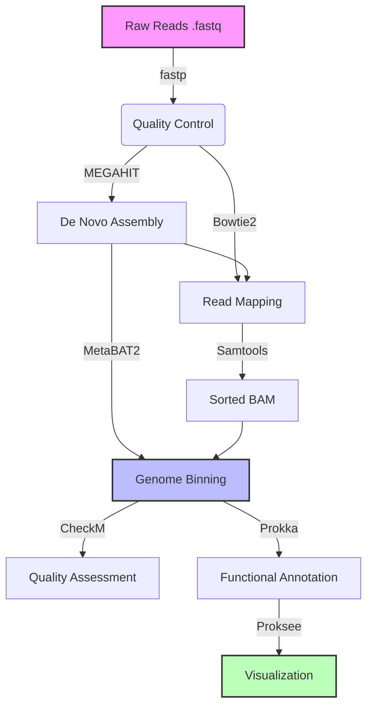
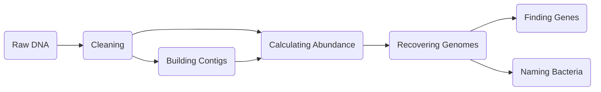

# MetaG_pipelin

# 🧬 Metagenomic Profiling Pipeline: From Reads to MAGs


## 📖 Introduction

**Shotgun Metagenomics** has revolutionized our ability to study microbial communities directly from environmental samples without cultivation. This project implements a comprehensive bioinformatics pipeline to recover **Metagenome-Assembled Genomes (MAGs)** from raw sequencing data.

The pipeline simulates a high-performance computing (HPC) workflow, encompassing quality control, de novo assembly, read mapping, genome binning, and functional annotation. It was validated using the **ZymoBIOMICS Microbial Community Standard**, successfully recovering high-quality genomes with distinct functional profiles.

## 🔄 Workflow Strategy

The analysis follows a "Assembly-First" approach, optimized for recovering low-abundance genomes.



# 🧬 The Metagenomics Handbook: A Practical Pipeline


## 🌟 Vision
This project is built **for the community**. Its goal is to demystify **Shotgun Metagenomics** analysis by providing a transparent, reproducible, and easy-to-understand pipeline. Whether you are a student, a researcher, or a hobbyist, this repository serves as a practical guide to recovering bacterial genomes from environmental samples.

## 🎯 What Will You Learn?
By exploring this repository, you will understand:
1.  **The "Why":** Why we filter reads, why we assemble, and why we bin.
2.  **The "How":** How to chain industry-standard tools (MEGAHIT, MetaBAT2, Prokka) into a seamless workflow.
3.  **The Result:** How to interpret biological data (Taxonomy & Function) from raw DNA code.

---

## 🏗️ Pipeline Architecture
The analysis is broken down into modular steps. Each step is a standalone script in the `scripts/` folder, allowing you to study them individually.


A comprehensive pipeline for metagenomic analysis from raw sequencing data to genome assembly, binning, and annotation.

## 🛠 Technologies & Dependencies

This pipeline relies on the following open-source tools, managed via Conda:

## 🛠 Pipeline Tools & Workflow
The following table details every tool used in this analysis, including versions, file types, and specific purposes.

| Tool | Version | Input File Type | Output File Type | Purpose |
| :--- | :--- | :--- | :--- | :--- |
| **1. fastp** | `0.23.4` | `.fastq` (Raw) | `.fastq` (Clean), `.json` | Quality Control (QC), trimming adapters, and filtering low-quality bases. |
| **2. MEGAHIT** | `1.2.9` | `.fastq` (Clean) | `.fa` (Contigs) | De Novo Assembly of short reads into long contigs using De Bruijn graphs. |
| **3. QUAST** | `5.2.0` | `.fa` (Contigs) | `.html` (Report) | Quality Assessment of the assembly (calculating N50, L50, total length). |
| **4. Bowtie2** | `2.5.4` | `.fastq`, `.fa` | `.sam` | Building index and Mapping raw reads back to the assembled contigs to determine coverage. |
| **5. Samtools** | `1.18` | `.sam` | `.bam` (Sorted) | Converting large SAM files to binary BAM format, sorting, and indexing for downstream tools. |
| **6. MetaBAT2** | `2.15` | `.fa`, `.bam` (Depth) | `.fa` (Bins) | Genome Binning; separating contigs into individual bacterial genomes based on abundance and tetranucleotide frequency. |
| **7. Kraken2** | `2.1.3` | `.fa` (Bins) | `.txt` (Report) | Taxonomic Classification; identifying the "Species" and "Genus" of the recovered bins. |
| **8. Prokka** | `1.14.6` | `.fa` (Bins) | `.gff`, `.tsv`, `.gbk` | Functional Annotation; predicting genes and proteins (coding sequences) within the genomes. |
| **9. Proksee** | Web | `.gbk` (Genbank) | `.png` (Image) | Visualization; creating circular genome maps to display gene density and features. |


## 📂 Output File Explanations (A to Z)

This pipeline generates several distinct file types across its stages. Below is a detailed breakdown of what each file contains and how to interpret it.

### 1. Quality Control (`clean_data/`)
Generated by **fastp**.
* **`clean_1.fastq`, `clean_2.fastq`**: The "clean" sequencing reads. Adapters have been trimmed, and poor-quality bases (Q-score < 30) removed. **These are used for assembly.**
* **`report.html`**: An interactive visual report. Open this in a web browser to see charts of:
    * *Adapter trimming stats*: How much "junk" was removed.
    * *Quality curves*: Should show high scores (green) across the read length.
* **`report.json`**: A text-based summary of the HTML report, useful for automated parsing.

### 2. Assembly (`assembly_result/`)
Generated by **MEGAHIT**.
* **`final.contigs.fa`**: **The most important file.** This FASTA file contains the assembled "Contigs" (long DNA sequences stitched together from the short reads).
    * *Format:* `>k141_1 flag=1 multi=5.0 len=1420` (Header includes length and coverage).
* **`intermediate_contigs/`**: Temporary files created during the De Bruijn graph construction (can be deleted to save space).

### 3. Evaluation (`quast_report/`)
Generated by **QUAST**.
* **`report.html`**: The dashboard for assembly quality.
    * **Look for:** The **N50** value. A higher N50 (e.g., >20,000) indicates a more continuous and better assembly.
* **`transposed_report.tsv`**: A spreadsheet version of the statistics, useful if comparing multiple assemblies in Excel.

### 4. Mapping & Depth (`mapping/`)
Generated by **Bowtie2** and **Samtools**.
* **`assembly_index.*.bt2`**: Binary index files required by Bowtie2 to search the assembly quickly.
* **`mapped.sam`**: (Sequence Alignment Map) A massive text file showing exactly where every raw read maps onto the contigs. *Usually deleted after conversion to save space.*
* **`mapped.sorted.bam`**: (Binary Alignment Map) The compressed, sorted version of the SAM file.
* **`mapped.sorted.bam.bai`**: The index file allowing software to jump to specific regions in the BAM file.
* **`depth.txt`**: A text file listing the "Abundance" (Coverage) of every contig.
    * *Why it's crucial:* **MetaBAT2** uses this to group contigs. If Contig A and Contig B both have 50x coverage, they likely belong to the same bacterium.

### 5. Binning (`bins/`)
Generated by **MetaBAT2**.
* **`bin.1.fa`, `bin.2.fa`, ...**: The recovered **Metagenome-Assembled Genomes (MAGs)**.
    * Each file represents a single bacterial genome separated from the mix.
    * If you have 8 files, you successfully recovered 8 distinct organisms.

### 6. Taxonomy (`taxonomy/`)
Generated by **Kraken2**.
* **`*_report.txt`**: The hierarchical classification.
    * *Format:* Shows the percentage of reads assigned to Domain -> Phylum -> Class... -> Species.
    * *Use this:* To answer "Who is in my sample?" (e.g., *Salmonella enterica*, *Bacillus subtilis*).
* **`*_output.txt`**: A detailed, read-by-read classification (very large file, mostly used for debugging).

### 7. Annotation (`annotation/`)
Generated by **Prokka**. A folder is created for each bin (e.g., `annotation/bin1/`).
* **`*.gff` (General Feature Format)**: The master file containing coordinates of all genes, CDS (coding sequences), and RNAs. Used by genome browsers.
* **`*.faa` (Protein FASTA)**: Contains the amino acid sequences of all predicted proteins.
    * *Use this:* For BLAST searches or building phylogenetic trees.
* **`*.fna` (Nucleotide FASTA)**: Contains the DNA sequences of the genes.
* **`*.tsv` (Tab-Separated Values)**: **The most human-readable file.**
    * *Use this:* Open in Excel. It lists every gene found, its name (e.g., `dnaK`), and its function/product (e.g., "Molecular chaperone DnaK").
* **`*.gbk` (GenBank)**: A standard file containing both sequence and annotation.
    * *Use this:* Upload to **Proksee** or **Artemis** to visualize the genome map.
* **`*.txt`**: A summary of the annotation (e.g., "Number of tRNA: 45", "Number of CDS: 3200").

---

## 📂 Directory Structure
```text
.
├── scripts/           # Contains individual shell scripts for each step
├── envs/              # Conda environment configuration
├── raw_data/          # Input FASTQ files (Git ignored)
├── results/           # Analysis outputs (Git ignored)
└── README.md          # Project documentation
```
## ⚙️ Installation & Setup

To ensure reproducibility, an `environment.yml` file is provided to recreate the exact software environment.

```bash
# 1. Clone the repository
git clone https://github.com/AnasSaadawi/Metagenomics-Pipeline.git
cd Metagenomics-Pipeline

# 2. Create Conda environment
conda env create -f environment.yml

# 3. Activate the environment
conda activate meta_pipeline
```
