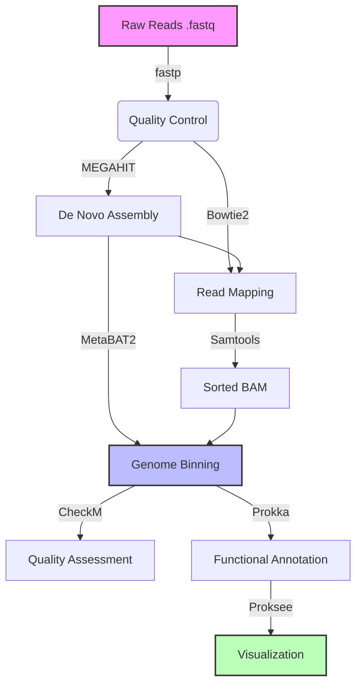

# Meta_pipli

# 🧬 Metagenomic Profiling Pipeline: From Reads to MAGs


## 📖 Introduction

**Shotgun Metagenomics** has revolutionized our ability to study microbial communities directly from environmental samples without cultivation. This project implements a comprehensive bioinformatics pipeline to recover **Metagenome-Assembled Genomes (MAGs)** from raw sequencing data.

The pipeline simulates a high-performance computing (HPC) workflow, encompassing quality control, de novo assembly, read mapping, genome binning, and functional annotation. It was validated using the **ZymoBIOMICS Microbial Community Standard**, successfully recovering high-quality genomes with distinct functional profiles.

## 🔄 Workflow Strategy

The analysis follows a "Assembly-First" approach, optimized for recovering low-abundance genomes.


# Metagenomics Pipeline

A comprehensive pipeline for metagenomic analysis from raw sequencing data to genome assembly, binning, and annotation.

## 🛠 Technologies & Dependencies

This pipeline relies on the following open-source tools, managed via Conda:

## 🛠 Pipeline Tools & Workflow
The following table details every tool used in this analysis, including versions, file types, and specific purposes.

| Tool | Version | Input File Type | Output File Type | Purpose |
| :--- | :--- | :--- | :--- | :--- |
| **1. fastp** | `0.23.4` | `.fastq` (Raw) | `.fastq` (Clean), `.json` | Quality Control (QC), trimming adapters, and filtering low-quality bases. |
| **2. MEGAHIT** | `1.2.9` | `.fastq` (Clean) | `.fa` (Contigs) | De Novo Assembly of short reads into long contigs using De Bruijn graphs. |
| **3. QUAST** | `5.2.0` | `.fa` (Contigs) | `.html` (Report) | Quality Assessment of the assembly (calculating N50, L50, total length). |
| **4. Bowtie2** | `2.5.4` | `.fastq`, `.fa` | `.sam` | Building index and Mapping raw reads back to the assembled contigs to determine coverage. |
| **5. Samtools** | `1.18` | `.sam` | `.bam` (Sorted) | Converting large SAM files to binary BAM format, sorting, and indexing for downstream tools. |
| **6. MetaBAT2** | `2.15` | `.fa`, `.bam` (Depth) | `.fa` (Bins) | Genome Binning; separating contigs into individual bacterial genomes based on abundance and tetranucleotide frequency. |
| **7. Kraken2** | `2.1.3` | `.fa` (Bins) | `.txt` (Report) | Taxonomic Classification; identifying the "Species" and "Genus" of the recovered bins. |
| **8. Prokka** | `1.14.6` | `.fa` (Bins) | `.gff`, `.tsv`, `.gbk` | Functional Annotation; predicting genes and proteins (coding sequences) within the genomes. |
| **9. Proksee** | Web | `.gbk` (Genbank) | `.png` (Image) | Visualization; creating circular genome maps to display gene density and features. |

## 📂 Directory Structure
```text
.
├── scripts/           # Contains individual shell scripts for each step
├── envs/              # Conda environment configuration
├── raw_data/          # Input FASTQ files (Git ignored)
├── results/           # Analysis outputs (Git ignored)
└── README.md          # Project documentation
```
## ⚙️ Installation & Setup

To ensure reproducibility, an `environment.yml` file is provided to recreate the exact software environment.

```bash
# 1. Clone the repository
git clone https://github.com/AnasSaadawi/Metagenomics-Pipeline.git
cd Metagenomics-Pipeline

# 2. Create Conda environment
conda env create -f environment.yml

# 3. Activate the environment
conda activate meta_pipeline
```
